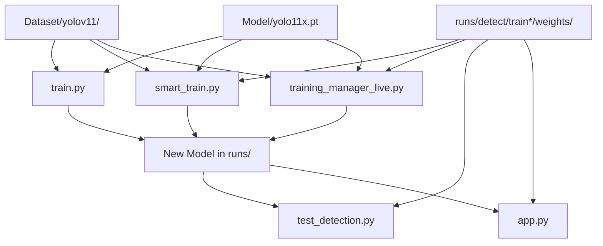

# 🎯 YOLO Object Detection Project

A comprehensive YOLO-based object detection system for detecting and classifying cosmetic products with multiple training interfaces, real-time detection capabilities, and advanced model management.

## 📋 Project Overview

This project implements YOLOv11 object detection to identify specific cosmetic products:
- **"7 OILS IN ONE 100 ML"** - Hair oil products
- **"BORO PLUS ANTIBACTERIAL SOAP 100 GM"** - Soap products

The system includes multiple interfaces for training, testing, and real-time detection with comprehensive model management capabilities.

## 🏗️ Project Architecture

```
Image_object_dct/
├── 📝 Training Scripts
│   ├── train.py                    # Basic training script (original)
│   ├── smart_train.py             # Intelligent training with auto-resume
│   ├── training_manager.py        # Streamlit training interface (basic)
│   └── training_manager_live.py   # Advanced live training manager
├── 🎯 Detection & Testing
│   ├── test_detection.py          # Simple image upload testing interface
│   └── app.py                     # Full-featured detection app (camera + upload)
├── 📊 Data & Models
│   ├── Dataset/yolov11/           # Dataset configuration and structure
│   ├── Model/                     # Pre-trained base models
│   └── runs/detect/               # Training results and fine-tuned models
├── 🔧 Configuration
│   ├── .gitignore                 # Git ignore rules
│   ├── requirements.txt           # Python dependencies (if exists)
│   └── README.md                  # This documentation
└── 🐍 Python Environment
    └── venv/                      # Virtual environment
```

## ⚡ Quick Start

### 1. 🔧 Environment Setup

```powershell
# Clone the repository
git clone <repository-url>
cd Image_object_dct

# Create and activate virtual environment
python -m venv venv
.\venv\Scripts\Activate  # Windows PowerShell

# Install dependencies
pip install torch torchvision --index-url https://download.pytorch.org/whl/cu129
pip install ultralytics streamlit opencv-python pillow
```

### 2. 📊 Dataset Structure

Ensure your dataset follows this structure:
```
Dataset/yolov11/
├── dataset.yaml          # YOLO configuration file
├── classes.txt          # Class names
├── train/               # Training images and labels
│   ├── images/
│   └── labels/
├── val/                 # Validation images and labels
│   ├── images/
│   └── labels/
└── test/                # Test images and labels
    ├── images/
    └── labels/
```

### 3. 🎯 Base Model Setup

Place your base YOLO model in:
```
Model/yolo11x.pt         # Pre-trained YOLOv11 model
```

## 🚀 Usage Guide

### 🔥 Method 1: Smart Training (Recommended)

**Auto-detects latest model and resumes training:**

```powershell
python smart_train.py
```

**Features:**
- ✅ Automatically finds latest fine-tuned model
- ✅ Falls back to base model if none exists
- ✅ Intelligent model selection
- ✅ Enhanced error handling

### 🎮 Method 2: Live Training Manager (Most Advanced)

**Complete training management interface:**

```powershell
streamlit run training_manager_live.py
```

**Features:**
- 📚 **Model Browser**: View all available models with metrics
- 🔍 **Performance Comparison**: Compare mAP, precision, recall
- ⚙️ **Training Configuration**: Customize epochs, batch size, device
- 📊 **Real-time Monitoring**: Live progress bars and metrics
- 🔄 **Background Training**: Non-blocking interface
- 📝 **Live Logs**: Stream training output in real-time
- ✅ **Auto-refresh**: Updates model list after training

### 🧪 Method 3: Simple Image Testing

**Quick model testing interface:**

```powershell
streamlit run test_detection.py
```

**Features:**
- 📁 **Easy Upload**: Drag & drop image testing
- 🎚️ **Confidence Control**: Adjustable detection threshold
- 📊 **Detailed Results**: Object counts and confidence scores
- 👀 **Side-by-side View**: Original vs detected image

### 📹 Method 4: Full Detection App

**Complete detection system with camera:**

```powershell
streamlit run app.py
```

**Features:**
- 📹 **Live Camera**: Real-time webcam detection
- 🖼️ **Image Upload**: Single image analysis
- 🎬 **Video Processing**: Batch video analysis
- 🎛️ **Controls**: Start/stop camera, confidence adjustment

### 📝 Method 5: Basic Training

**Simple command-line training:**

```powershell
python train.py
```

## 🔗 File Connections & Dependencies

### 📊 Data Flow Architecture



### 🔧 Component Relationships

#### **Training Pipeline:**
1. **`train.py`** → Basic training → **`runs/detect/train/`**
2. **`smart_train.py`** → Auto-resume → **`runs/detect/train2/`**
3. **`training_manager_live.py`** → GUI training → **`runs/detect/train3/`**

#### **Detection Pipeline:**
1. **Models** (`Model/` + `runs/detect/*/weights/`) → **Detection Apps**
2. **`test_detection.py`** → Image upload → **Results**
3. **`app.py`** → Multi-modal detection → **Real-time results**

#### **Configuration Chain:**
- **`Dataset/yolov11/dataset.yaml`** → Defines data paths
- **Training scripts** → Read dataset.yaml → **Model training**
- **Detection apps** → Load trained models → **Inference**

## 🎛️ Configuration Files

### 📄 dataset.yaml
```yaml
# YOLO dataset configuration
path: ./yolov11                    # Dataset root
train: train                      # Training subset
val: val                         # Validation subset  
test: test                       # Test subset

nc: 2                            # Number of classes
names: ['7 OILS IN ONE 100 ML', 'BORO PLUS ANTIBACTERIAL SOAP 100 GM']
```

### 🎯 Training Parameters

**Default Configuration:**
- **Image Size**: 640x640
- **Batch Size**: 8
- **Epochs**: 100
- **Device**: GPU (0) / CPU
- **Workers**: 0 (Windows compatibility)
- **Patience**: 50 (early stopping)

## 📊 Model Management

### 🏆 Model Hierarchy

1. **Base Model**: `Model/yolo11x.pt` (Pre-trained)
2. **Fine-tuned Models**: `runs/detect/train*/weights/`
   - **`best.pt`**: Best performing checkpoint
   - **`last.pt`**: Latest training checkpoint

### 🔄 Auto-Resume Logic

```python
Priority Order:
1. Latest fine-tuned model (newest best.pt)
2. Base model (yolo11x.pt)
3. Error if nothing found
```

## 🎯 Interface Comparison

| Feature | train.py | smart_train.py | test_detection.py | app.py | training_manager_live.py |
|---------|----------|----------------|-------------------|--------|--------------------------|
| **Training** | ✅ Basic | ✅ Smart | ❌ No | ❌ No | ✅ Advanced |
| **Auto-resume** | ❌ No | ✅ Yes | ❌ No | ❌ No | ✅ Yes |
| **GUI Interface** | ❌ No | ❌ No | ✅ Simple | ✅ Full | ✅ Advanced |
| **Real-time Progress** | ❌ No | ❌ No | ❌ No | ❌ No | ✅ Yes |
| **Model Comparison** | ❌ No | ❌ No | ❌ No | ❌ No | ✅ Yes |
| **Image Testing** | ❌ No | ❌ No | ✅ Yes | ✅ Yes | ❌ No |
| **Camera Support** | ❌ No | ❌ No | ❌ No | ✅ Yes | ❌ No |
| **Background Training** | ❌ No | ❌ No | ❌ No | ❌ No | ✅ Yes |

## 🛠️ Development Workflow

### 🔄 Typical Development Cycle

1. **Initial Training**:
   ```powershell
   python smart_train.py  # First training run
   ```

2. **Model Testing**:
   ```powershell
   streamlit run test_detection.py  # Test with images
   ```

3. **Continue Training**:
   ```powershell
   streamlit run training_manager_live.py  # Advanced training
   ```

4. **Production Testing**:
   ```powershell
   streamlit run app.py  # Full detection system
   ```

### 🐛 Debugging & Monitoring

- **Training Logs**: Check `runs/detect/train*/` for detailed logs
- **Model Metrics**: View in `results.csv` and `results.png`
- **Real-time Monitoring**: Use `training_manager_live.py`
- **Error Handling**: All scripts include comprehensive error handling

## 📈 Performance Monitoring

### 📊 Available Metrics

- **mAP@50**: Mean Average Precision at IoU 0.5
- **mAP@50-95**: Mean Average Precision at IoU 0.5-0.95
- **Precision**: True positives / (True positives + False positives)
- **Recall**: True positives / (True positives + False negatives)
- **Box Loss**: Bounding box regression loss
- **Class Loss**: Classification loss

### 🎯 Model Selection Criteria

**For Training Continuation:**
- Use **`best.pt`** for optimal performance
- Use **`last.pt`** for latest state (if training interrupted)

**For Inference:**
- Always use **`best.pt`** for production
- Lower confidence threshold for more detections
- Higher confidence threshold for fewer false positives

## 🚀 Advanced Features

### 🔥 Smart Training System
- **Automatic Model Detection**: Scans all training runs
- **Timestamp-based Selection**: Uses newest model automatically
- **Fallback Mechanism**: Base model if no fine-tuned version
- **Progress Tracking**: Real-time epoch and loss monitoring

### 🎮 Live Training Manager
- **Multi-model Comparison**: Side-by-side performance metrics
- **Interactive Selection**: Click to choose training base model
- **Real-time Streaming**: Live training logs and progress
- **Background Processing**: Non-blocking training execution

### 📱 Detection Interfaces
- **Multi-modal Support**: Images, videos, live camera
- **Confidence Control**: Real-time threshold adjustment
- **Performance Optimization**: Frame skipping, buffer management
- **Cross-platform**: Windows, Linux, macOS compatibility

## 🔍 Troubleshooting

### 🐛 Common Issues

**1. Camera Not Working:**
```powershell
# Issue: DirectShow/MSMF errors
# Solution: App includes multiple backend fallbacks
```

**2. Model Not Found:**
```powershell
# Issue: FileNotFoundError for model
# Solution: Ensure base model exists in Model/yolo11x.pt
```

**3. Dataset Path Error:**
```powershell
# Issue: Dataset not found
# Solution: Check dataset.yaml path configuration
```

**4. Training Interrupted:**
```powershell
# Issue: Training stops unexpectedly
# Solution: Use smart_train.py to auto-resume from best checkpoint
```

### 🛠️ System Requirements

- **Python**: 3.8+
- **GPU**: CUDA-compatible (recommended)
- **RAM**: 8GB+ (16GB recommended)
- **Storage**: 5GB+ for models and datasets
- **Camera**: USB/built-in camera for real-time detection

## 🎯 Next Steps

### 🚀 Potential Enhancements

1. **Model Export**: ONNX/TensorRT conversion for deployment
2. **API Integration**: REST API for remote inference
3. **Data Augmentation**: Advanced augmentation pipeline
4. **Multi-class Expansion**: Support for more product categories
5. **Cloud Deployment**: Docker containerization and cloud hosting

### 📚 Learning Resources

- **YOLOv11 Documentation**: [Ultralytics Docs](https://docs.ultralytics.com/)
- **Streamlit Documentation**: [Streamlit Docs](https://docs.streamlit.io/)
- **Computer Vision**: OpenCV and PIL libraries
- **Deep Learning**: PyTorch framework fundamentals

---

## 🤝 Contributing

1. Fork the repository
2. Create feature branch: `git checkout -b feature/amazing-feature`
3. Commit changes: `git commit -m 'Add amazing feature'`
4. Push to branch: `git push origin feature/amazing-feature`
5. Open a Pull Request

## 📄 License

This project is licensed under the MIT License - see the LICENSE file for details.

## 🙏 Acknowledgments

- **Ultralytics** for the YOLOv11 implementation
- **Streamlit** for the web interface framework
- **OpenCV** for computer vision capabilities
- **PyTorch** for the deep learning foundation

---

*💡 **Tip**: Start with `smart_train.py` for training and `test_detection.py` for testing. Use `training_manager_live.py` for advanced model management!*

## Setup Instructions

### 1. Clone the Repository

```bash
git clone <your-repository-url>
cd Image_object_dct
```

### 2. Create Python Virtual Environment

```bash
python -m venv venv
```

### 3. Activate Virtual Environment

**Windows (PowerShell):**
```powershell
.\venv\Scripts\Activate.ps1
```

**Windows (Command Prompt):**
```cmd
venv\Scripts\activate
```

**Linux/macOS:**
```bash
source venv/bin/activate
```

### 4. Install Dependencies

Install the required Python packages:

```bash
# Install Ultralytics (includes YOLO)
pip install ultralytics

# Install PyTorch with CUDA support (for GPU training)
pip3 install torch torchvision --index-url https://download.pytorch.org/whl/cu128
```

**Note:** The CUDA 12.8 version is used above. If you have a different CUDA version, visit [PyTorch Installation Guide](https://pytorch.org/get-started/locally/) to get the correct installation command.

### 5. Download Pre-trained Model

Create a `Model` folder and download the YOLOv11 model:

```bash
# Create Model directory
mkdir Model

# Download YOLOv11x model (you can also use yolo11n.pt, yolo11s.pt, yolo11m.pt, yolo11l.pt)
# Visit https://github.com/ultralytics/ultralytics and download yolo11x.pt
# Place the downloaded file in the Model/ directory
```

**Model Options:**
- `yolo11n.pt` - Nano (fastest, least accurate)
- `yolo11s.pt` - Small 
- `yolo11m.pt` - Medium
- `yolo11l.pt` - Large
- `yolo11x.pt` - Extra Large (slowest, most accurate)

### 6. Prepare Dataset

#### Dataset Structure
Your dataset should follow this structure:

```
Dataset/
└── yolov11/
    ├── dataset.yaml         # Already provided
    ├── classes.txt          # Already provided
    ├── train/
    │   ├── images/          # Training images (.jpg, .png)
    │   └── labels/          # Training labels (.txt)
    ├── val/
    │   ├── images/          # Validation images
    │   └── labels/          # Validation labels
    └── test/
        ├── images/          # Test images
        └── labels/          # Test labels
```

#### Label Format
Each label file should contain bounding box annotations in YOLO format:
```
class_id center_x center_y width height
```

Where:
- `class_id`: 0 for "7 OILS IN ONE 100 ML", 1 for "BORO PLUS ANTIBACTERIAL SOAP 100 GM"
- `center_x, center_y`: Center coordinates (normalized 0-1)
- `width, height`: Box dimensions (normalized 0-1)

#### Adding Your Dataset
1. Place your training images in `Dataset/yolov11/train/images/`
2. Place corresponding label files in `Dataset/yolov11/train/labels/`
3. Place validation images in `Dataset/yolov11/val/images/`
4. Place corresponding label files in `Dataset/yolov11/val/labels/`
5. (Optional) Place test images in `Dataset/yolov11/test/images/`
6. (Optional) Place corresponding label files in `Dataset/yolov11/test/labels/`

### 7. Configuration Files

The project includes pre-configured files:

#### `Dataset/yolov11/dataset.yaml`
```yaml
path: ./Dataset/yolov11
train: train
val: val
test: test

nc: 2
names: ['7 OILS IN ONE 100 ML', 'BORO PLUS ANTIBACTERIAL SOAP 100 GM']
```

#### `Dataset/yolov11/classes.txt`
```
7 OILS IN ONE 100 ML
BORO PLUS ANTIBACTERIAL SOAP 100 GM
```

### 8. Start Training

Run the training script:

```bash
python train.py
```

#### Training Parameters
The current configuration in `train.py`:
- **Model**: YOLOv11x (extra large)
- **Image size**: 640x640
- **Batch size**: 8
- **Epochs**: 100
- **Workers**: 0 (for Windows compatibility)
- **Device**: 0 (GPU 0, change to 'cpu' for CPU training)

#### Modify Training Parameters
You can edit `train.py` to customize training:

```python
from ultralytics import YOLO

model = YOLO("./Model/yolo11x.pt")

model.train(
    data="./Dataset/yolov11/dataset.yaml",
    imgsz=640,          # Image size
    batch=8,            # Batch size (reduce if GPU memory issues)
    epochs=100,         # Number of training epochs
    workers=0,          # Number of data loading workers
    device=0            # GPU device (0, 1, 2...) or 'cpu'
)
```

### 9. Monitor Training

Training results will be saved in the `runs/detect/train/` directory:
- `weights/best.pt` - Best model weights
- `weights/last.pt` - Last epoch weights
- `results.png` - Training metrics plot
- `confusion_matrix.png` - Confusion matrix
- Various curve plots (P, R, F1, etc.)

### 10. System Requirements

#### Minimum Requirements:
- Python 3.8+
- 8GB RAM
- 10GB free disk space

#### Recommended for GPU Training:
- NVIDIA GPU with 6GB+ VRAM
- CUDA 11.8 or 12.x
- 16GB+ RAM
- 50GB+ free disk space

#### CPU Training:
- Multi-core CPU
- 16GB+ RAM
- Expect significantly longer training times

## Troubleshooting

### Common Issues:

1. **CUDA Out of Memory**
   - Reduce batch size in `train.py`
   - Use a smaller model (yolo11n.pt instead of yolo11x.pt)

2. **Dataset Not Found**
   - Ensure dataset.yaml path is correct
   - Check that images and labels are in the correct directories

3. **Permission Errors**
   - Run PowerShell as Administrator (Windows)
   - Check file permissions

4. **Import Errors**
   - Ensure virtual environment is activated
   - Reinstall packages: `pip install --upgrade ultralytics torch torchvision`

## Usage After Training

After training, you can use the trained model for inference:

```python
from ultralytics import YOLO

# Load trained model
model = YOLO('runs/detect/train/weights/best.pt')

# Run inference
results = model('path/to/your/image.jpg')

# Display results
results[0].show()
```

## File Management

### What's Tracked in Git:
- Python scripts (`train.py`)
- Configuration files (`Dataset/yolov11/dataset.yaml`, `Dataset/yolov11/classes.txt`)
- Documentation (`README.md`)
- Git configuration (`.gitignore`)

### What's NOT Tracked in Git:
- Virtual environment (`venv/`)
- Model files (`*.pt`, `Model/`)
- Dataset images and labels
- Training results (`runs/`)
- Cache files

This keeps the repository lightweight while preserving all necessary code and configuration.